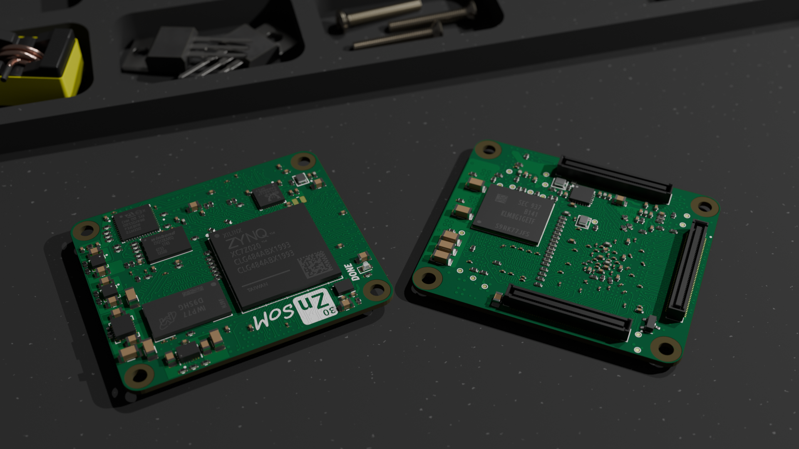

# Zynq SoM Board

## Overview
This repository contains the hardware design files for a System on Module based on Xilinx Zynq 7020 SoC (FPGA + Dual Core ARM Cortex A9).

<!--  -->
<!--  -->

## Description

> [!Warning] 
> First prototype is under testing. The design has not been fully verified.

#### Block Diagram

##  Features

Memory

- 512Mb DDR3L RAM
- 8Gb eMMC
- 16Mb Boot Flash

Connectivity

- 1x **Ethernet Gigabit**
- 1x **USB 2.0 High Speed** OTG 
- 1x **USB 2.0 Full speed** + USB PD (STM32)

- 7x Zynq PS GPIO (3.3V)
- 6x Zynq PS GPIO (1.8V) (External SD Card)
- 48x Zynq PL differential pairs (1.2-3.3V)
- 56x Zynq PL single ended IO (1.2-3.3V)
- 8x STM32 GPIO (3.3V)

Debug

- Zynq JTAG (3.3V)
- STM32 SWD (3.3V)

## Folder Structure

The repository is structured as follows:
- `schematics` contains the Kicad schematic sheets and schematic pdf 
- `scripts` contains a collection of python scripts used during the SoM/Carrier design phase
- `manufacturing/assembly` containts the BOM and pick-and-place position files
- `manufacturing/fabrication` containts the Gerber files and fabrication pdf 
- `lib` contains footprints and 3d models

## Production

JLCPCB ordering information:

- Layers: 8
- PCB Thickness: 1.2 mm
- Material Type: FR-4 TG155
- Stackup:  JLC08121H-1080A
- Outer Copper Weigth:  1 oz
- Inner Copper Weigth: 0.5 oz
- Minimum via diameter/hole-size: 0.3/0.2 mm
- Via Covering: Epoxy Filled and Capped
- Surface finish: ENIG

