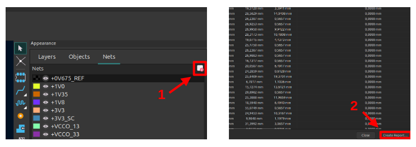
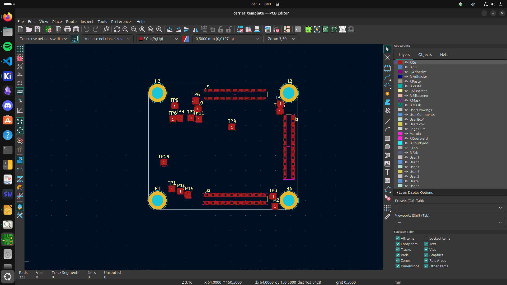
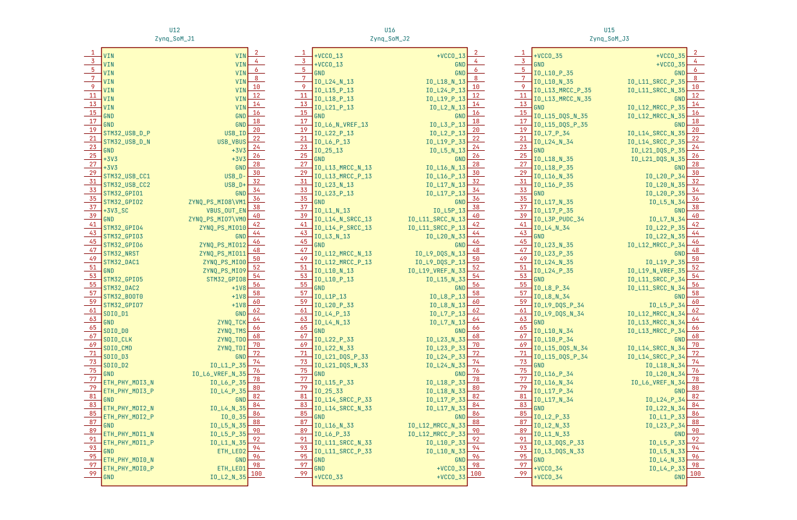

# Scripts

This  folder contains:
- A python script to add die lengths to the Xilinx SoC footprint
- A python script to calculate SoM pcb track propagation delays
- A Kicad plugin to create a carrier pcb template
- A bash script to generate carrier connector symbols

## Requirements
python pandas


## `footprint_add_die_lengths.py`

This script adds die lengths to the Zynq SoC `<footprint_name>.kicad_mod` footprint.

Xilinx provides Die-to-Package delay data by specifying **max** and **min** delay values (in *ps*). Unluckly, Kicad footprints can only store die-length values (in *mm*).

Equivalent Die-length values are calculated as the average Die-to-Package delay multiplied by the microstrip propagation speed (approximated to 1/6 *mm/ps* for common FR4 boards).

$$ \frac{T_{D,max} + T_{D,min}}{2}\cdot V_{p*}$$

Where:
- $V_{p*}$ = miscrostrip propagation speed (hardcoded to 1/6 *mm/ps*)
- $T_{D}$ = Die-to-Package delay (*ps*)

### Usage
Run in terminal 
```bash
python footprint_add_die_lengths.py xc7z020clg484_delays.csv CLG484_XIL.kicad_mod
```
The resulting footprint is saved as `<footprint_name>_with_die_lengths.kicad_mod`

## `calculate_track_delays.py`
This script calculates propagation delays/skews for the following signal groups:
- DDR CMD/ADDR Bus
- DDR Data lanes
- Boot flash QSPI 
- eMMC SDIO 
- ETH RMGII TX
- ETH RMGII RX
- USB ULPI

Delays are calculated as 

$$ \frac{DL}{V_{p*}} + \sum_{layers} \frac{TL_{\,layer}}{V_{p,layer}}$$

Where:
- $DL$ = Package Die-Length [*mm*] (stored in footprint)
- $V_{p*}$ = 1/6 *mm/ps* (used during Die-Length calculation see [footprint_add_die_lengths](#footprint_add_die_lengthspy))
- $TL_{\,layer}$ = signal trace length for that specific layer [*mm*]
- $V_{p,layer}$ = signal propagation speed for that specific layer and signal type (differential or single-ended) [*mm/ps*]

>[!NOTE]
>- Outer layer Propagation speeds (microstrip) are lower compared to inner layers (stripline).
>- Propagation speed can vary between differential and single-ended signals

Via delays are not considered in the calculations. 

### Usage
1. With pcbnew create a Net Inspector Report named `tracklengths.csv` and save it inside `/scripts` subfolder


2. Run in terminal:
```bash
python calculate_track_delays.py tracklengths.csv
```
Results are printed out in terminal.

## `create_carrier_template_plugin.py` 

This script generates a `.kicad_pcb` template used as a starting point for carrier board designs.

It places footprints for
- mating connectors (with die-lengths*)
- standoffs
- testing probes



### Usage
This script needs to be executed inside pcbnew Python scripting console by running:
```python
import os
exec(open(os.path.expandvars("${KIPRJMOD}/scripts/create_carrier_template_plugin.py")).read())
```
The `.kicad_pcb` template file can be found inside the `carrier_template` folder, together with the `.csv` files that will be used by [symbol_creation.bash](#symbol_creationbash) to create the SoM carrier connector symbols.

>[!NOTE]
>Schematic symbols need to be manually linked to the  generated footprints:
>- symbol references needs to be edited to match the  respective `.kicad_pcb` footprint references
>- symbol footprints needs to match the `.kicad_pcb` footprints
## `symbol_creation.bash`

This bash script uses the previously generated `.csv` files to create a  symbol library (`.lib`) containing the SoM carrier  connector symbols.
### Usage
Run in terminal:
```bash
source symbol_creation.bash
```
The library file is saved as `symbol_Zynq_SoM.lib` (Kicad < V6.0). Conversion to the newer `.kicad_sym` format can be done during import by clicking the "Migrate Library" button inside Symbol Library Manager.




